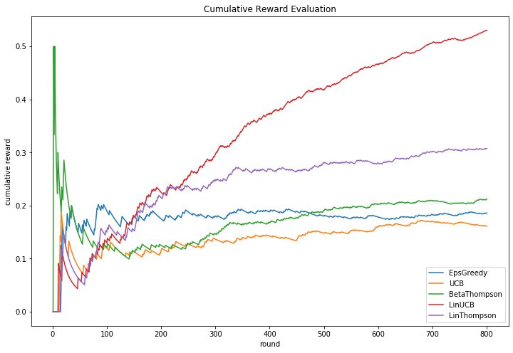

# MAB
This is COMP90051 Project 2 about implemented multi-armed Bandit algorithms including e-greedy, UCB, Thompson, LinUCB, LinThompson, as well as evaluation of their performance. You can run the code in your jupyter notebook without requiring any extra libraries.

